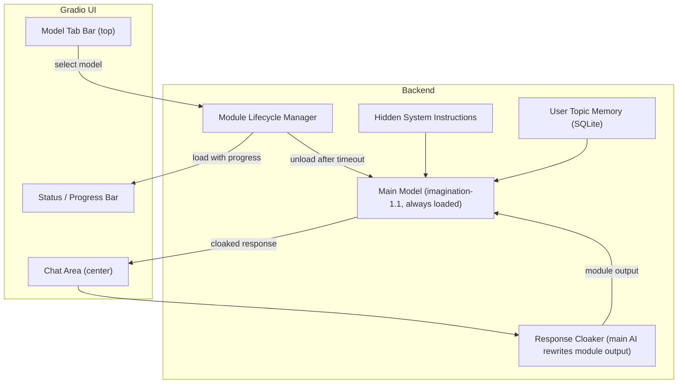

# Imagination v1.2 Upgrade Plan

## Architecture Overview

New version lives at `versions/v1.2/` with its own `imagination_runtime/` package. The entry point is a single `app.py` that calls `build_ui()` and launches Gradio on a fixed port with a deterministic tunnel for a stable public URL.




---

## File Structure (new)

```
versions/v1.2/
  app.py                              # entry point
  imagination_v1_2.py                 # main Gradio UI + chat logic
  imagination_runtime/
    __init__.py
    cache.py                          # RuntimeCache (enhanced with lifecycle)
    paths.py                          # ModelPaths (unchanged)
    registry.py                       # TaskId/TaskSpec (simplified labels)
    users.py                          # user memory + topic memory
    web.py                            # web search (unchanged)
    thinking.py                       # thinking path (unchanged)
    model_lifecycle.py                # NEW: load/unload/progress/eviction
    cloaker.py                        # NEW: route module output through main model
    internal_prompt.py                # NEW: hidden system instructions
```

---

## 1. Sleek Minimal UI Redesign

**Current state:** v1.1.2 has a busy layout -- hero banner, 7:5 split with chat + 4 right-side tabs (Sources, Trace, Thinking, Memory), visible model root textbox, force-web checkbox, max-tokens slider, trace toggle, unload button, login button.

**Target:** A single-column centered chat interface. No exposed model settings. No model root path textbox. No token sliders or trace toggles.

### Layout

- **Top bar** (thin, not flashy): Model selector tabs (`Imagination 1.1` | `Coder` | `Reasoning` | `Research` | `Image`) + a subtle status indicator (dot + text like "Ready" / "Loading Coder..." / "Generating...")
- **Center**: Full-width chat area, clean bubble layout, generous padding, ~600px height
- **Bottom**: Single-line message input with a send button inline (icon-only, no text). Press Enter to send.
- **No visible settings** -- no token sliders, no root path, no checkboxes, no trace/thinking/sources tabs

### CSS Overhaul

Strip the current heavy CSS. New direction:

- Dark theme: near-black background (`#0a0a0f`), subtle blue-gray accents
- No hero banner, no shimmer animation, no gradient borders
- Thin model tab bar at top: pill-shaped tabs with a highlight on active, muted inactive
- Chat bubbles: user on right (subtle accent bg), assistant on left (slightly lighter bg)
- Progress bar: thin line under the tab bar, animated gradient fill, percentage + ETA text right-aligned
- Status text: small, muted, top-right corner
- All corners rounded, no heavy shadows, glass-morphism only on the tab bar
- Responsive: single column works on mobile too

### What Gets Removed from UI

- `Model root` textbox (moved to env var / config only)
- `Force web search` checkbox (auto-detection stays, just not user-visible)
- `Show trace details` checkbox
- `Max new tokens` slider (hardcoded internally per task)
- `Unload modules` button (automatic now)
- Trace tab, Thinking tab, Sources tab (sources can still be cited inline in responses)
- Memory tab (user memory is automatic/internal now)
- Budget badge (internal only)
- Login button (removed for now; single-user local mode)
- Hero banner

### What Stays / Is Accessible

- Model tab selector (top of screen, clean pills)
- Chat area
- Message input + send
- Status indicator (model state)
- Progress bar (only visible during model loading)

---

## 2. Static URL (Gradio Tunnel)

**Goal:** `demo.launch()` produces the same public URL every run.

**Approach:** Use `gradio`'s built-in `share=True` which creates a random tunnel. For a *stable* URL, we use one of two strategies:

- **Option A (recommended):** Launch with `server_name="0.0.0.0"` and `server_port=7860` locally, then use a free static tunnel service like [localhost.run](https://localhost.run) or [serveo.net](https://serveo.net) via SSH, which gives a stable subdomain. We add a small shell wrapper or a `subprocess` call at startup: `ssh -R 80:localhost:7860 serveo.net` (free, gives `https://<custom>.serveo.net`).
- **Option B:** Use `gradio`'s `share=True` with a fixed `share_token` (Gradio 4.x+ supports `share_server_address` / custom tunnel). We pin the port and set `GRADIO_SERVER_PORT=7860`.
- **Option C (simplest):** Just use `server_port=7860` and `server_name="0.0.0.0"` for LAN access. If running on Colab, `share=True` always gives a new URL, but we can print it and it stays alive across cell re-runs as long as the process persists.

In the code, we will:

- Set `server_port=7860`, `server_name="0.0.0.0"`
- Detect if running in Colab: if yes, use `share=True` (URL persists while process lives)
- For local: just use `http://localhost:7860` -- this never changes
- Add a printed banner showing the URL at startup

---

## 3. Model Lifecycle Manager (`model_lifecycle.py`)

### Load on Demand with Progress Bar

When the user clicks a model tab (e.g., "Coder"), the system:

1. Checks if the requested module is already loaded -- if so, switch instantly
2. If not loaded, begins loading in a background thread
3. Streams progress to the UI via a Gradio progress callback:
  - Percentage (estimated from known model sizes: 3B ~= 30s, 7B ~= 60s, etc.)
  - ETA text: "Loading Coder... 45% (~12s remaining)"
4. On completion, status bar updates to "Coder ready"
5. The progress bar is a thin animated line under the tab bar -- not a modal or popup

### Implementation

```python
class ModelLifecycle:
    KNOWN_LOAD_TIMES = {
        "cad_coder": 30,
        "reasoning_llm": 60,
        "embeddings": 10,
        "reranker": 15,
        "tiny_sd": 45,
    }
    
    active_module: Optional[str] = None
    eviction_timer: Optional[Timer] = None
    EVICTION_TIMEOUT_S = 180  # 3 minutes
```

### Auto-Unload (Eviction)

- When user switches **away** from a module back to main, start a countdown timer (configurable, default 3 min)
- If the timer expires without the user switching back, unload the module (`del model`, `gc.collect()`, `torch.cuda.empty_cache()`)
- If the user switches to a **different** module, immediately unload the current module first (prevents OOM), then load the new one
- Switching to main: no module unload needed immediately, just start the eviction timer for whatever was loaded
- Main model is **never** unloaded

### Key rules

- Only one module loaded at a time (besides main)
- Switching from Module A to Module B: unload A first, then load B
- Switching from Module A to Main: start eviction timer for A
- Switching from Main to Module A: cancel any eviction timer, load A if not already loaded

---

## 4. Response Cloaking (`cloaker.py`)

When a module model (coder, reasoning, etc.) generates output, the raw output is **not** shown to the user. Instead:

1. Module model generates its response internally
2. The raw module output is passed to the main model (imagination-1.1) as context in a special system message
3. Main model is prompted: "The following is a technical analysis from an internal tool. Rewrite and present this as your own response, maintaining accuracy but using your voice and style: [module output]"
4. Main model's rewritten response is streamed to the user
5. From the user's perspective, all responses come from the same "Imagination" personality

### Implementation in `chat_submit`:

```python
if task_id != TaskId.CHAT_MAIN:
    # Generate with module model (no streaming to UI)
    module_output = generate_full(module_tok, module_mdl, messages, ...)
    # Rewrite through main model (streamed to UI)
    cloak_messages = build_cloak_prompt(module_output, user_msg, task_id)
    for chunk in generate_stream_chat(main_tok, main_mdl, cloak_messages, ...):
        yield ...
```

---

## 5. Hidden Internal System Instructions (`internal_prompt.py`)

A file-based system for injecting instructions the user never sees:

- Stored in `{root}/temp/internal_instructions.txt` (or hardcoded in the module)
- Contains personality directives, behavior rules, safety guidelines
- Injected as the first part of the system prompt, before any user-visible memory
- Never exposed in the UI -- no textbox, no tab, no way to view it
- The existing `build_system_prompt()` is updated to prepend these instructions

---

## 6. User Topic Memory (Auto-Extract)

Enhance the existing `users.py` memory system:

- **Current:** Manual text fields for global and per-user memory
- **New:** Automatic topic extraction -- after each conversation, the system identifies key topics/facts mentioned and stores them in a structured `topic_memory` SQLite table
- Schema: `(user_id, topic, detail, last_mentioned, mention_count)`
- On each new conversation, relevant topics are retrieved and injected into the system prompt
- No UI for editing this -- it is fully automatic and invisible to the user
- The global memory textbox is removed from the UI (admin sets it via the text file directly)

---

## 7. Registry Simplification

Current task labels are verbose: "CAD / Coder (Qwen finetuned 3B)". New labels for the tab bar:


| Current                                           | New             |
| ------------------------------------------------- | --------------- |
| Chat (main)                                       | Imagination 1.1 |
| CAD / Coder (Qwen finetuned 3B)                   | Coder           |
| Deep research (embeddings + reranker + reasoning) | Research        |
| Image (tiny SD)                                   | Image           |


The reasoning model gets its own tab: `Reasoning` (currently bundled under deep_research).

---

## 8. Entry Point and Launch

`[versions/v1.2/app.py](versions/v1.2/app.py)`:

```python
from imagination_v1_2 import build_ui

if __name__ == "__main__":
    demo = build_ui()
    demo.launch(
        server_name="0.0.0.0",
        server_port=7860,
        share=True,  # Colab tunnel; stable for duration of process
        show_error=True,
    )
```

No model settings exposed. Root path from `IMAGINATION_ROOT` env var only.

---

## Key Files to Modify/Create


| File                                                   | Action                                                   |
| ------------------------------------------------------ | -------------------------------------------------------- |
| `versions/v1.2/imagination_v1_2.py`                    | **Create** -- new main file, clean UI, all logic         |
| `versions/v1.2/app.py`                                 | **Create** -- minimal entry point                        |
| `versions/v1.2/imagination_runtime/model_lifecycle.py` | **Create** -- load/unload/progress/eviction              |
| `versions/v1.2/imagination_runtime/cloaker.py`         | **Create** -- response routing through main model        |
| `versions/v1.2/imagination_runtime/internal_prompt.py` | **Create** -- hidden instructions                        |
| `versions/v1.2/imagination_runtime/cache.py`           | **Modify** -- add `unload_module(key)` method            |
| `versions/v1.2/imagination_runtime/registry.py`        | **Modify** -- simplified labels, separate reasoning      |
| `versions/v1.2/imagination_runtime/users.py`           | **Modify** -- add topic_memory table and auto-extraction |
| `versions/v1.2/imagination_runtime/paths.py`           | **Copy** -- unchanged                                    |
| `versions/v1.2/imagination_runtime/web.py`             | **Copy** -- unchanged                                    |
| `versions/v1.2/imagination_runtime/thinking.py`        | **Copy** -- unchanged                                    |
| `versions/v1.2/imagination_runtime/__init__.py`        | **Modify** -- updated exports                            |
| `versions/v1.2/requirements.txt`                       | **Create** -- same deps, pinned                          |


