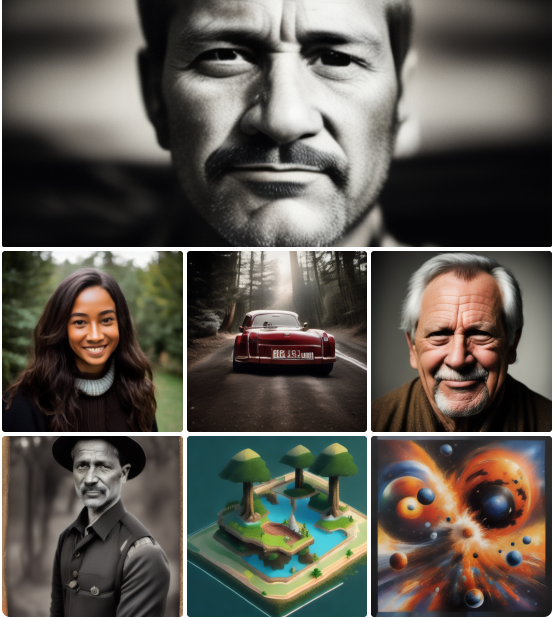
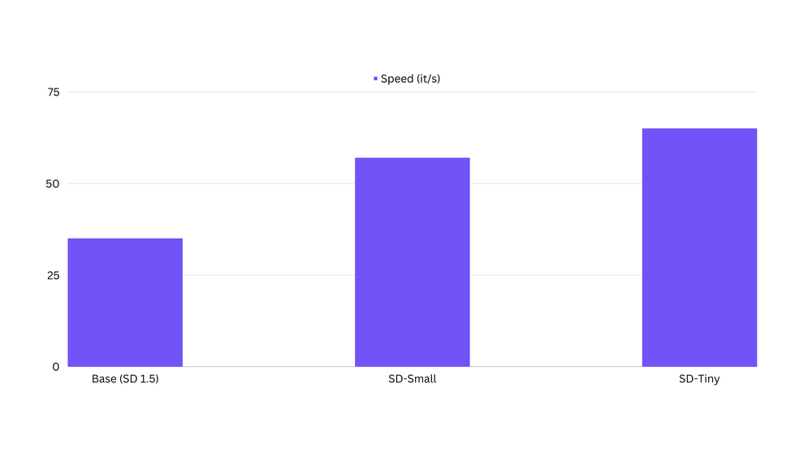
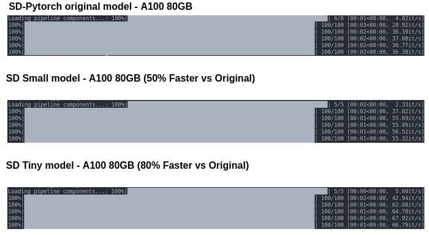

---
license: creativeml-openrail-m
base_model: SG161222/Realistic_Vision_V4.0
datasets:
- recastai/LAION-art-EN-improved-captions
tags:
- stable-diffusion
- stable-diffusion-diffusers
- text-to-image
- diffusers
inference: true
---
    
# Text-to-image Distillation

This pipeline was distilled from **SG161222/Realistic_Vision_V4.0** on a Subset of **recastai/LAION-art-EN-improved-captions** dataset. Below are some example images generated with the tiny-sd model. 




This Pipeline is based upon [the paper](https://arxiv.org/pdf/2305.15798.pdf). Training Code can be found [here](https://github.com/segmind/distill-sd).

## Pipeline usage

You can use the pipeline like so:

```python
from diffusers import DiffusionPipeline
import torch

pipeline = DiffusionPipeline.from_pretrained("segmind/tiny-sd", torch_dtype=torch.float16)
prompt = "Portrait of a pretty girl"
image = pipeline(prompt).images[0]
image.save("my_image.png")
```

## Training info

These are the key hyperparameters used during training:

* Steps: 125000
* Learning rate: 1e-4
* Batch size: 32
* Gradient accumulation steps: 4
* Image resolution: 512
* Mixed-precision: fp16

## Speed Comparision

We have observed that the distilled models are upto 80% faster than the Base SD1.5 Models. Below is a comparision on an A100 80GB.




[Here](https://github.com/segmind/distill-sd/blob/master/inference.py) is the code for benchmarking the speeds.


